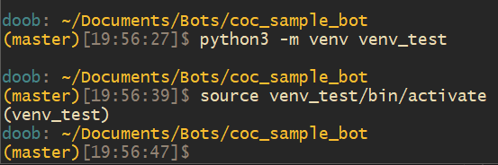

# Clash of Clans Sample Discord Bot [Python]
Sample Discord bot, using Python, to access the Clash of Clans API

## Getting Started
1. Install the latest version of [Python](https://www.python.org/).
1. Sign up for a [Clash of Clans Developer Account](https://developer.clashofclans.com/#/).
1. Sign up for a [Discord Developer Account](https://discordapp.com/developers) and create an App with a Bot User.
1. Rename `creds_sample.py` to `creds.py` and add your Clash of Clans Account email and password, and your Discord Bot Token.
1. Create and activate a virtual environment `python3 -m venv venv_bot && source venv_bot/bin/activate`
1. Run `pip install -r requirements.txt` to install dependencies like the discord.py & coc.py libraries.
1. Run `python bot.py`

## Test Your Bot
1. Add your bot to a test Discord Server using an URL like this:
`https://discordapp.com/oauth2/authorize?client_id=`Insert Client ID from your Discord App`&scope=bot`
1. Send the command `!clan #CLASH_CLAN_TAG` to load info about the clan. 

## About virtual environments
New developers may not see the benefit of using a virtual environment until they start making a second or third bot. They may come to realize that updating their packages for one bot will interfere with the other bots and potentially even breaking their other bots. This is because you are downloading and updating your packages globally. A way around this is using virtual environments to segregate projects.
### Create the environment
```
python3 -m venv venv_test
```
### Activate the environment
```
source venv_test/bin/activate
```
You should now see your environment tag in the command line indicating that you are now in the virtual environment.

## Project Developers
TubaKid, Sidekick, mathsman, majordoobie...

Find us and ask questions at https://discord.gg/Eaja7gJ